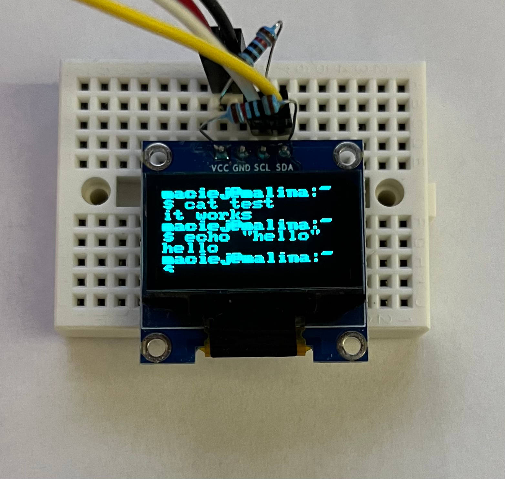
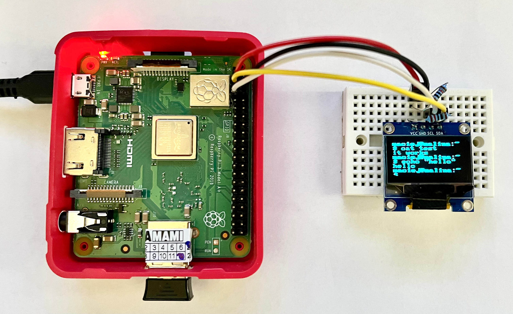

# SSD1306 Linux Driver
This repository contains my implementation of kernel driver for displays based on the SSD1306 chip. The driver uses I2C for communication with the display and device tree for binding.
 
Overview:
* Monochrome display
* Uses I2C for communication
* Uses `fbdev` kernel framework, display is exposed to userspace as `/dev/fbX`
* Buildroot support
* Uses Device Tree
* Tested on BeagleBone Black Rev. C and Raspberry Pi 3A+. Additional device tree definitions must be provided when using different platforms.
  
## Demo

 

## Building the driver
Following steps show how to build the driver on target system, RPi 3A+ has been used as an example:
* Run `make` in the cloned repository to build the driver kernel module
* Build device tree overlay: `dtc -@ -I dts -O dtb -o pi3a.dtbo dt/pi3a.dts`
* Load the overlay: `sudo dtoverlay pi3a.dtbo`
* Load the module: `sudo insmod ssd1306_mod.ko`

Required packages: `linux-headers`, `build-essential`, `device-tree-compiler`